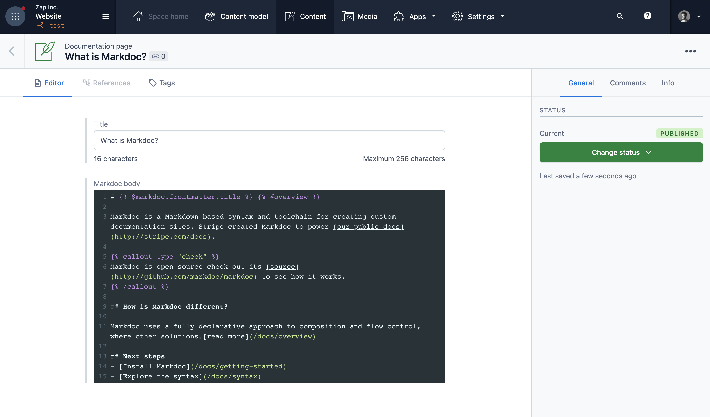

# markdoc-contentful

Adds a [Markdoc](//markdoc.io) field to Contentful.

[](https://app.contentful.com/deeplink?link=apps&id=6QQQMMiwG4BrQotBxihJRY)

## Usage

After installation, create or use JSON field and assign the Markdoc app to the field via the _Appearance_ tab in the settings.



On your website, you'll be able to use the field value just like any other field. The response of the Markdoc fields will look something like this:

```json
{
  "raw": "Markdoc is a Markdown-based syntax and ...",
  "ast": { "$$mdtype": "Node","errors":[],"lines":[],"inline":false ... },
  "renderableTree": { "$$mdtype":"Tag","name":"article","attributes" ... }
}
```

## Todo

- [ ] Inline preview
- [ ] Error handling
- [ ] Custom components/styling
